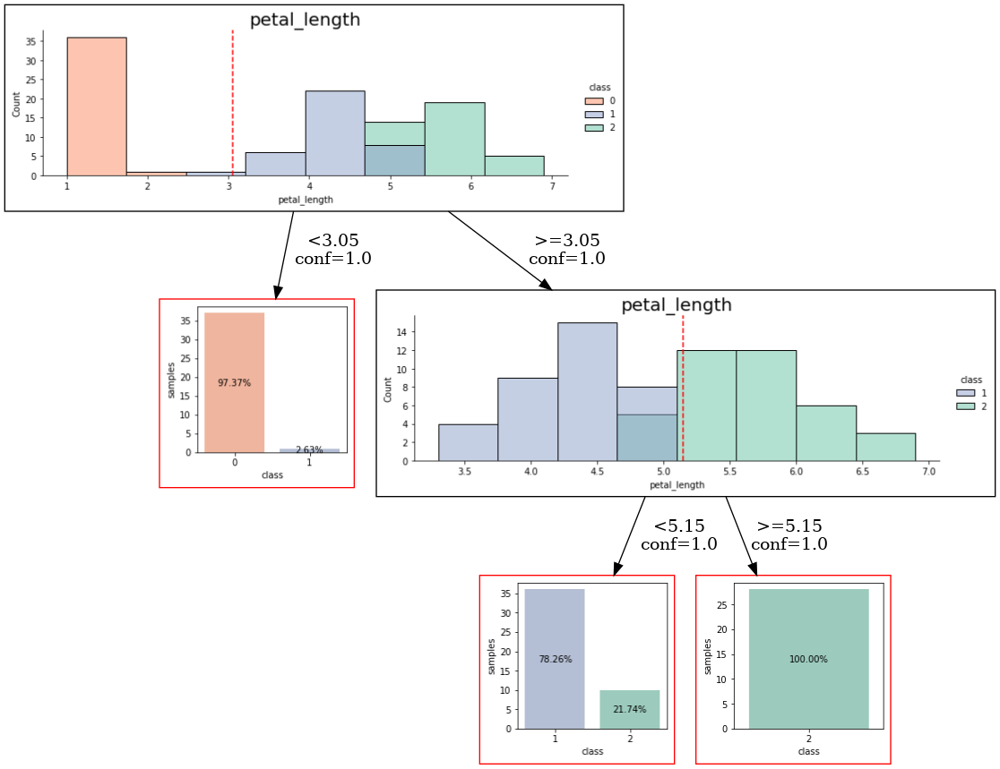

# LUX (Local Uncertain Explanations)
## Main features
  * Model-agnostic, local explanations of black-box ML models
  * Rule-based explanations (that are executable at the same time)
  * Possible integration with [Shapley values](https://shap.readthedocs.io/en/latest/) or [Lime](https://github.com/marcotcr/lime) importances (or any other explainer that produces importances) that help in generating high quality rules
  
## About
Local Uncertain Explanations -- brigns uncertianty into the explainable model in a straightforward way.
The workflow for LUX looks as follows:
  - You train an arbitrary selected machine learning model on your train dataset. The only requirements is that the model is able to output probabilities.
  
  
  - Next, you generate neighbourgood of an instance you wish to explain and you feed this neighbourhood to your model. This gives you training set to LUX, as the output form the model constains uncertainty of the decisions (probabilities of instance A being at class X)
  
  
  - You obtain a decision stump, which locally explains the model and is executable by [HeaRTDroid](https://heartdroid.re) inference engine
  
  
  - You can obtain explanation for a selected instance (the number after # represents confidence of an explanation):
  ```
  ['IF x2  < 0.01 AND  THEN class = 1 # 0.9229009792453621']
  ```

## Installation

First of all  clonde the repository and its submodules, and enter it:
```
git clone https://github.com/sbobek/lux.git
cd lux
git submodule update --init --recursive
```
Some of the packages used in LUX anre not available in conda, hence the following code should set up all of the requirements in virtual environment:

```
conda create --name luxenv python=3.8
conda activate luxenv
conda install pip
pip install -r requirements.txt
```
If you want to use LUX with [JupyterLab](https://jupyter.org/) install it and run while being in activated in `luxenv` environment:

```
pip isntall jupyterlab
jupyter lab
```

## Usage

For complete usage see `lux_usage_example.ipynb`

### Simple exmaple on Iris dataset

``` python
from lux.lux import LUX
from sklearn import datasets
from sklearn.model_selection import train_test_split
from sklearn import svm
import numpy as np
import pandas as pd
# import some data to play with
iris = datasets.load_iris()
features = ['sepal_length','sepal_width','petal_length','petal_width']
target = 'calss'

#create daatframe with columns names as strings (LUX accepts only DataFrames withj string columns names)
df_iris = pd.DataFrame(iris.data,columns=features)
df_iris[target] = iris.target

#train classifier
train, test = train_test_split(df_iris)
clf = svm.SVC(probability=True)
clf.fit(train[features],train[target])
clf.score(test[features],test[target])

#pick some instance from datasetr
iris_instance = train[features].sample(1).values
iris_instance

#train lux on neighbourhood equal 20 instances
lux = LUX(predict_proba = clf.predict_proba, neighborhood_size=20,max_depth=2,  node_size_limit = 1, grow_confidence_threshold = 0 )
lux.fit(train[features], train[target], instance_to_explain=iris_instance,class_names=[0,1,2])

#see the justification of the instance being classified for a given class
lux.justify(np.array(iris_instance))

```

The above code should give you the answer as follows:
```
IF petal_length  >= 4.9 AND petal_width  >= 1.2 AND  THEN class = 2 # 0.9147101904644878
```

### Rule-based model for local uncertain explanations
You can obtain a whole rule-based model for the local uncertian explanation that was generated by LUX for given instance by running following code

``` python
#have a look at the entire rule-based model that can be executed with https:://heartdroid.re
print(lux.to_HMR())
```

This will generate model which can later be executed by [HeaRTDroid](https://heartdroid.re)

```
%%%%%%%%%%%%%%%%%%%%%%%%%%%%%% TYPES DEFINITIONS %%%%%%%%%%%%%%%%%%%%%%%%%%

xtype [
 name: class, 
base:symbolic,
 domain : [2,0,1]].
xtype [
 name: petal_length, 
base:numeric,
domain : [-100000 to 100000]].
xtype [
 name: petal_width, 
base:numeric,
domain : [-100000 to 100000]].

%%%%%%%%%%%%%%%%%%%%%%%%% ATTRIBUTES DEFINITIONS %%%%%%%%%%%%%%%%%%%%%%%%%%
xattr [ name: class,
 type:class,
 class:simple,
 comm:out ].
xattr [ name: petal_length,
 type:petal_length,
 class:simple,
 comm:out ].
xattr [ name: petal_width,
 type:petal_width,
 class:simple,
 comm:out ].

%%%%%%%%%%%%%%%%%%%%%%%% TABLE SCHEMAS DEFINITIONS %%%%%%%%%%%%%%%%%%%%%%%%
 xschm tree : [petal_length,petal_width]==> [class].
xrule tree/0:
[petal_length  lt 1.9, petal_width  lt 1.2] ==> [class set 0]. # 0.957062830836548
xrule tree/1:
[petal_length  gte 1.9, petal_width  lt 1.2] ==> [class set 0]. # 0.9386780937191352
xrule tree/2:
[petal_length  lt 4.9, petal_width  gte 1.2] ==> [class set 1]. # 0.8517079680142385
xrule tree/3:
[petal_length  gte 4.9, petal_width  gte 1.2] ==> [class set 2]. # 0.9147101904644878
```
### Visualization of the local uncertain explanation
Similarly you can obtain visualization of the rule-based model in a form of decision tree by executing following code

``` python
#prind the uncertain local tree for the given instance
import graphviz
lux.uid3.tree.save_dot('tree.dot')
graphviz.Source.from_file('tree.dot')
```

The code should yeld something like that (depending on the instance that was selected):



# Cite this work

```
@InProceedings{lux2021iccs,
  author="Bobek, Szymon
  and Nalepa, Grzegorz J.",
  editor="Paszynski, Maciej
  and Kranzlm{\"u}ller, Dieter
  and Krzhizhanovskaya, Valeria V.
  and Dongarra, Jack J.
  and Sloot, Peter M. A.",
  title="Introducing Uncertainty into Explainable AI Methods",
  booktitle="Computational Science -- ICCS 2021",
  year="2021",
  publisher="Springer International Publishing",
  address="Cham",
  pages="444--457",
  isbn="978-3-030-77980-1"
}
